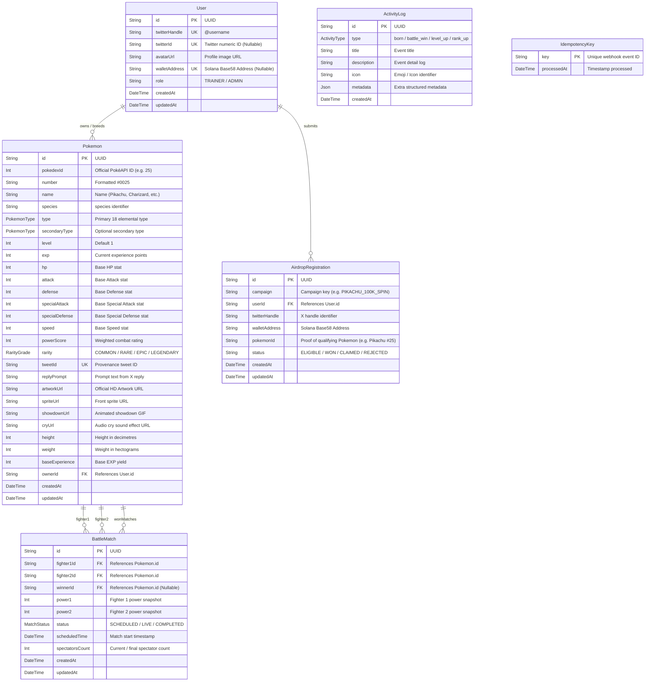

# 🗄️ PokéPump Database Schema Documentation

Dokumentasi arsitektur basis data PostgreSQL untuk platform **PokéPump** yang dikelola menggunakan **Prisma ORM**.

---

## 📊 Entity Relationship Diagram (ERD)

---

## 🏷️ Enums

### 1. `PokemonType` (18 Tipe Resmi Pokémon)
| Nilai Enum | Deskripsi | Warna Aksen |
| :--- | :--- | :--- |
| `normal` | Tipe Normal | `#9FA19F` |
| `fire` | Tipe Api | `#E65A36` |
| `water` | Tipe Air | `#3B8AE4` |
| `grass` | Tipe Rumput | `#5EA843` |
| `electric` | Tipe Listrik | `#E5A51A` |
| `ice` | Tipe Es | `#5DBCCF` |
| `fighting` | Tipe Petarung | `#E03020` |
| `poison` | Tipe Racun | `#9241CC` |
| `ground` | Tipe Tanah | `#9E6D38` |
| `flying` | Tipe Terbang | `#82A5F5` |
| `psychic` | Tipe Psikis | `#D14B92` |
| `bug` | Tipe Serangga | `#91A119` |
| `rock` | Tipe Batu | `#857F70` |
| `ghost` | Tipe Hantu | `#8043C4` |
| `dragon` | Tipe Naga | `#5060E1` |
| `steel` | Tipe Baja | `#60A1B8` |
| `dark` | Tipe Gelap | `#433E4D` |
| `fairy` | Tipe Peri | `#EE70AC` |

### 2. `RarityGrade`
- `COMMON`: Base Stat Total (BST) < 400 (contoh: Charmander, Bulbasaur).
- `RARE`: Base Stat Total (BST) 400 - 499 (contoh: Pikachu, Ivysaur, Haunter).
- `EPIC`: Base Stat Total (BST) 500 - 579 (contoh: Charizard, Gengar, Lucario, Blastoise).
- `LEGENDARY`: Base Stat Total (BST) ≥ 580 (contoh: Mewtwo, Rayquaza, Zapdos).

### 3. `MatchStatus`
- `SCHEDULED`: Pertandingan terjadwal di arena.
- `LIVE`: Pertandingan sedang berlangsung secara real-time.
- `COMPLETED`: Pertandingan telah selesai dan pemenang telah ditentukan.

### 4. `ActivityType`
- `born`: Pokémon baru berhasil menetas dari reply tweet di X.
- `battle_win`: Kemenangan dalam duel arena pertarungan.
- `level_up`: Kenaikan level dan peningkatan stat Pokémon.
- `rank_up`: Kenaikan peringkat trainer/Pokémon pada leaderboard.

---

## 📋 Struktur Tabel Lengkap

### Tabel `User`
Menyimpan profil trainer dari Twitter / X beserta alamat dompet Web3 (Solana).

| Kolom | Tipe Data | Constraint | Deskripsi |
| :--- | :--- | :--- | :--- |
| `id` | `TEXT (UUID)` | `PRIMARY KEY` | ID unik trainer |
| `twitterHandle` | `TEXT` | `UNIQUE`, `INDEX` | Handle Twitter (contoh: `@cryptomaster`) |
| `twitterId` | `TEXT` | `UNIQUE` (Nullable) | ID numerik Twitter |
| `avatarUrl` | `TEXT` | Nullable | Foto profil Twitter |
| `walletAddress` | `TEXT` | `UNIQUE`, `INDEX` (Nullable) | Alamat Solana Wallet Base58 (contoh: `7xKX...`) |
| `role` | `TEXT` | `DEFAULT 'TRAINER'` | Peran trainer (`TRAINER` / `ADMIN`) |
| `createdAt` | `TIMESTAMP` | `DEFAULT now()` | Waktu registrasi |
| `updatedAt` | `TIMESTAMP` | `AUTO UPDATE` | Waktu pembaruan terakhir |

---

### Tabel `AirdropRegistration` *(NEW)*
Menyimpan data pendaftaran peserta untuk campaign airdrop & Spin Wheel pool di Pumpfun.

| Kolom | Tipe Data | Constraint | Deskripsi |
| :--- | :--- | :--- | :--- |
| `id` | `TEXT (UUID)` | `PRIMARY KEY` | ID unik pendaftaran |
| `campaign` | `TEXT` | `DEFAULT 'PIKACHU_100K_SPIN'` | Kode campaign airdrop |
| `userId` | `TEXT (UUID)` | `FOREIGN KEY` | Relasi ke `User.id` |
| `twitterHandle` | `TEXT` | `INDEX` | Handle Twitter peserta |
| `walletAddress` | `TEXT` | `INDEX` | Alamat wallet Solana tujuan airdrop |
| `pokemonId` | `TEXT` | Nullable | ID Pikachu yang dimiliki sebagai bukti kualifikasi |
| `status` | `TEXT` | `DEFAULT 'ELIGIBLE'` | Status entri (`ELIGIBLE`, `WON`, `CLAIMED`, `REJECTED`) |
| `createdAt` | `TIMESTAMP` | `DEFAULT now()` | Waktu pendaftaran |
| `updatedAt` | `TIMESTAMP` | `AUTO UPDATE` | Waktu update status |

> **Unique Constraints**:
> - `@@unique([campaign, twitterHandle])` ➔ 1 Akun Twitter hanya bisa mendaftar 1 kali per campaign.
> - `@@unique([campaign, walletAddress])` ➔ 1 Wallet Solana hanya bisa didaftarkan 1 kali per campaign (mencegah Sybil / multi-account abuse).

---

### Tabel `Pokemon`
Menyimpan data Pokémon asli dari PokéAPI beserta status pemilik dan rekor pertarungannya.

| Kolom | Tipe Data | Constraint | Deskripsi |
| :--- | :--- | :--- | :--- |
| `id` | `TEXT (UUID)` | `PRIMARY KEY` | ID unik entitas Pokémon |
| `pokedexId` | `INTEGER` | `INDEX` | ID Pokédex resmi PokéAPI (contoh: `25` untuk Pikachu, `6` untuk Charizard) |
| `number` | `TEXT` | Not Null | Format Pokédex nomor (contoh: `#0025`) |
| `name` | `TEXT` | Not Null | Nama Pokémon (contoh: `Pikachu`) |
| `species` | `TEXT` | Not Null | Spesies Pokémon (lowercase) |
| `type` | `PokemonType` | `INDEX (composite)` | Tipe elemen utama (18 tipe) |
| `secondaryType`| `PokemonType` | Nullable | Tipe elemen sekunder |
| `level` | `INTEGER` | `DEFAULT 1` | Level Pokémon |
| `exp` | `INTEGER` | `DEFAULT 0` | Total experience points |
| `hp` | `INTEGER` | `DEFAULT 50` | Base HP stat |
| `attack` | `INTEGER` | `DEFAULT 50` | Base Physical Attack |
| `defense` | `INTEGER` | `DEFAULT 50` | Base Physical Defense |
| `specialAttack`| `INTEGER` | `DEFAULT 50` | Base Special Attack |
| `specialDefense`| `INTEGER` | `DEFAULT 50` | Base Special Defense |
| `speed` | `INTEGER` | `DEFAULT 50` | Base Speed stat |
| `powerScore` | `INTEGER` | `INDEX (DESC)` | Skor kekuatan tempur |
| `rarity` | `RarityGrade` | `INDEX` | Tingkat kelangkaan |
| `tweetId` | `TEXT` | `UNIQUE` | ID tweet asal kelahiran |
| `replyPrompt` | `TEXT` | Nullable | Teks prompt reply X asal |
| `artworkUrl` | `TEXT` | Not Null | URL Official HD Artwork (PokéAPI) |
| `spriteUrl` | `TEXT` | Nullable | URL sprite depan |
| `showdownUrl` | `TEXT` | Nullable | URL animasi GIF pertarungan |
| `cryUrl` | `TEXT` | Nullable | URL suara audio cry Pokémon |
| `height` | `INTEGER` | Nullable | Tinggi Pokémon (dm) |
| `weight` | `INTEGER` | Nullable | Berat Pokémon (hg) |
| `baseExperience`| `INTEGER` | Nullable | Base experience yield |
| `ownerId` | `TEXT (UUID)` | `FOREIGN KEY`, `INDEX` | Pemilik Pokémon (`User.id`) |
| `createdAt` | `TIMESTAMP` | `DEFAULT now()` | Waktu diciptakan |
| `updatedAt` | `TIMESTAMP` | `AUTO UPDATE` | Waktu pembaruan |

---

### Tabel `BattleMatch`
Menyimpan jadwal dan riwayat pertandingan di battle arena.

| Kolom | Tipe Data | Constraint | Deskripsi |
| :--- | :--- | :--- | :--- |
| `id` | `TEXT (UUID)` | `PRIMARY KEY` | ID unik duel |
| `fighter1Id` | `TEXT (UUID)` | `FOREIGN KEY` | ID Pokémon petarung 1 |
| `fighter2Id` | `TEXT (UUID)` | `FOREIGN KEY` | ID Pokémon petarung 2 |
| `winnerId` | `TEXT (UUID)` | `FOREIGN KEY` (Nullable) | ID Pokémon pemenang |
| `power1` | `INTEGER` | Not Null | Power snapshot petarung 1 |
| `power2` | `INTEGER` | Not Null | Power snapshot petarung 2 |
| `status` | `MatchStatus` | `INDEX (composite)` | Status pertandingan |
| `scheduledTime`| `TIMESTAMP` | `INDEX (composite)` | Waktu mulai duel |
| `spectatorsCount`| `INTEGER`| `DEFAULT 0` | Jumlah penonton |
| `createdAt` | `TIMESTAMP` | `DEFAULT now()` | Waktu dibuat |
| `updatedAt` | `TIMESTAMP` | `AUTO UPDATE` | Waktu selesai |

---

### Tabel `ActivityLog`
Menyimpan riwayat feed aktivitas real-time untuk stream dashboard.

| Kolom | Tipe Data | Constraint | Deskripsi |
| :--- | :--- | :--- | :--- |
| `id` | `TEXT (UUID)` | `PRIMARY KEY` | ID unik log |
| `type` | `ActivityType` | Not Null | Jenis aktivitas |
| `title` | `TEXT` | Not Null | Judul event |
| `description` | `TEXT` | Not Null | Penjelasan event |
| `icon` | `TEXT` | Nullable | Ikon visual / emoji |
| `metadata` | `JSONB` | Nullable | Payload data terstruktur |
| `createdAt` | `TIMESTAMP` | `INDEX (DESC)` | Waktu kejadian |

---

### Tabel `IdempotencyKey`
Menjamin webhook dari X (Twitter) tidak dieksekusi berulang kali (deduplikasi event).

| Kolom | Tipe Data | Constraint | Deskripsi |
| :--- | :--- | :--- | :--- |
| `key` | `TEXT` | `PRIMARY KEY` | Hash unik ID event webhook |
| `processedAt`| `TIMESTAMP` | `DEFAULT now()` | Waktu event diproses |

---

## ⚡ Indeks Performa Tinggi (Composite & Sorted Indexes)

Untuk menjamin latensi rendah pada jutaan data:
- `User`:
  - `@@index([twitterHandle])` ➔ Pencarian profil cepat berdasarkan handle X.
  - `@@index([walletAddress])` ➔ Validasi unik wallet Solana secara instan.
- `AirdropRegistration`:
  - `@@index([campaign, status])` ➔ Filter cepat peserta yang eligible untuk Spin Wheel engine saat live stream.
  - `@@index([twitterHandle])` & `@@index([walletAddress])` ➔ Anti-Sybil checking O(1).
- `Pokemon`:
  - `@@index([ownerId])` ➔ Query seluruh Pokémon milik seorang trainer.
  - `@@index([pokedexId])` ➔ Query spesifik berdasarkan nomor Pokédex resmi (e.g. verifikasi kepemilikan Pikachu `#0025`).
  - `@@index([type, level])` ➔ Filter cepat berdasarkan tipe elemen dan level.
  - `@@index([powerScore(sort: Desc)])` ➔ Query leaderboard Pokémon terkuat secara instan.
  - `@@index([rarity])` ➔ Filter berdasarkan tingkat kelangkaan.
- `BattleMatch`:
  - `@@index([status, scheduledTime])` ➔ Mengambil match yang sedang `LIVE` atau `SCHEDULED` terdekat.
- `ActivityLog`:
  - `@@index([createdAt(sort: Desc)])` ➔ Mengambil stream aktivitas terbaru secara real-time.
